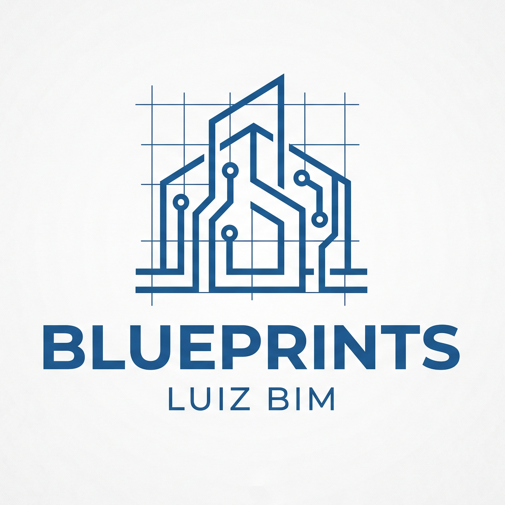

<p align="center">
  
</p>

# Blueprints

A collection of production-grade architecture patterns and projects built with TypeScript, AWS CDK, and event-driven design — each one a deliberate technical decision worth explaining.

---

## Philosophy

Every project in this repo starts with a real problem and a constraint. The architecture follows from those, not from defaults. Technology choices are made to be defended, not just convenient.

---

## Projects

### [`shapeshift`](./packages/shapeshift)

A production-grade CDC pipeline with a pluggable transformer layer and a real-time observability dashboard.

PostgreSQL with logical replication feeds Debezium, which publishes change events to Redpanda — a Kafka-compatible broker running on EC2 at a fraction of MSK cost. A NestJS transformer service consumes those events, applies entity-specific shapers to flatten and denormalize the Debezium envelope, and upserts into OpenSearch. Dead letters route through SQS. A Next.js dashboard surfaces pipeline health in real time: replication lag, event throughput, error rates, and a live search UI proving the indexed data is correct.

The transformer layer is the centrepiece — a pluggable processor interface where each entity type owns its own shaping logic, with idempotency, schema evolution handling, and DLQ routing built in. This is the layer most pipeline examples skip.

**Stack:** PostgreSQL · Debezium · Redpanda (Kafka-compatible) · NestJS · OpenSearch · SQS · AWS CDK · Next.js

---

## Stack

| Layer           | Technology      |
| --------------- | --------------- |
| Language        | TypeScript      |
| Backend         | NestJS, Node.js |
| Frontend        | Next.js, React  |
| Infrastructure  | AWS CDK         |
| Monorepo        | Nx              |
| Package manager | pnpm            |

---

## Design principles

**Cost awareness.** Managed services are chosen only when they justify their cost. Where a self-hosted or lighter alternative fits, it is used and documented with the trade-offs.

**Deployability.** Every project targets a personal AWS account at under $30/month. Infrastructure is one CDK command away from running.

**Explainability.** Every architectural decision has a reason. The README for each project explains not just what was built, but why — and what was considered and rejected.

---

## Getting started

```bash
pnpm install
```

Each project lives in its own directory with its own README covering local setup, CDK deployment, and architectural decisions.

---

## Author

**Luiz Augusto de Souza Bim**
Lead Software Engineer · TypeScript · AWS · Event-driven systems

[LinkedIn](https://www.linkedin.com/in/luiz-bim/) · [Email](mailto:luiz@luizbim.dev)
